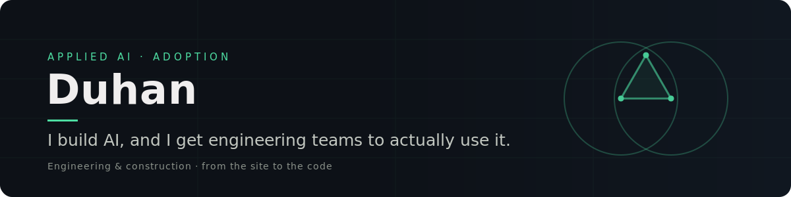
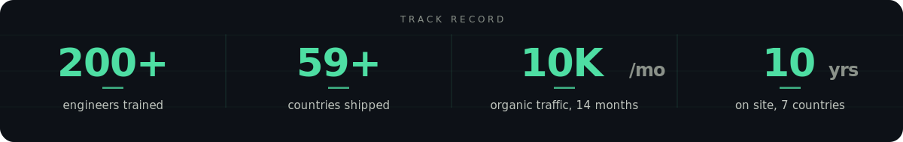

  

## I build AI, and I get engineering teams to actually use it.

Applied AI and adoption in engineering and construction. I find the use cases worth building, ship them to production, and train the people who run them. I have done that for 200+ engineers inside a global firm. The hard part was never the model. It is trust and adoption.

 

### What I do

- **Ship AI to production.** Real MVPs with engineering teams, with the observability and validation standards to run them safely. Not slideware.
- **Drive adoption.** I sit with the people doing the job, build tools they can read and check, and train them until it sticks. A tool nobody trusts is worth nothing.
- **Build the whole product.** From the model to the auth, the database, the billing and the analytics. I have taken a product from a first prompt to paying users in 59+ countries.

 

### Stack

  

**Applied AI / GenAI** &nbsp;·&nbsp; LLMs · RAG · AI agents · document intelligence · Claude / Claude Code · LangChain · LangGraph

**Image & vision** &nbsp;·&nbsp; Stable Diffusion · FLUX (fine-tuning) · ComfyUI · ControlNet · IP-Adapter · YOLO · Grounding DINO

**Cloud & infra** &nbsp;·&nbsp; AWS (Bedrock, AgentCore) · Google Cloud · Scaleway · Cloudflare · Hostinger · Terraform · Docker · GitHub Actions · CloudWatch · OpenTelemetry

**Data & backend** &nbsp;·&nbsp; Supabase · PostgreSQL · authentication · API design · Resend (transactional email) · Stripe & Lemon Squeezy billing

**Product & growth** &nbsp;·&nbsp; roadmap · discovery · customer-journey design · feedback loops · iteration · agile delivery · analytics (Amplitude, PostHog) · SEO / GEO · PMP-style governance

 

### Featured work

**Styly** — a generative-AI product, built and run end to end. Paying users in 59+ countries.
> Why it matters: I took it from a first prompt to paying users worldwide, including the parts nobody demos: auth, billing, growth and the analytics loop that tells you what to build next.

**spec-triage** — a Claude Code skill that reads a construction spec and returns the clauses that shift cost onto you, each one citing its page.
> Why it matters: it is built to be checked, not trusted blindly. Tested on real FIDIC and French tender documents, and it says what it cannot catch. That is what gets a skeptical engineer to actually use it.

**aec-digest** — a weekly intelligence pipeline over AEC and AI signals: scrape, enrich, and synthesize what actually matters.
> Why it matters: it turns noise into a short read that decides what to build and write next. Adoption starts with knowing the real problem.

Also: **[Matou](https://github.com/DoudouDoudouk/matou)**, a playful financial-education web app built at a France hackathon.

 

### Track record

  

Delivered a company's first GenAI talk and first ComfyUI session at Digital Engineering Week, and onboarded 200+ CAD/BIM users across India, Italy and Turkey.

 

### Background

Ten years leading engineering and construction projects across seven countries before I moved into software. MSc in Project Management with BIM, Politecnico di Milano. PMP. I work in English, French and Turkish.

 

### Where to find me

  
  &nbsp;
  

