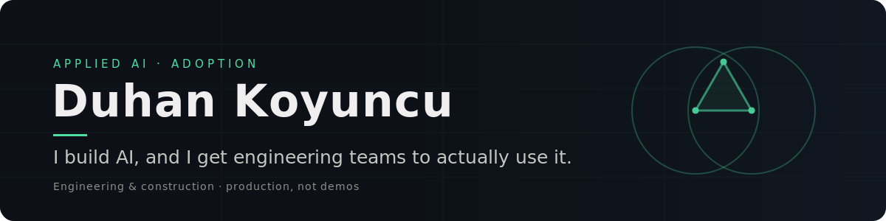

  

## I build AI, and I get engineering teams to actually use it.

Applied AI and adoption in engineering and construction. I find the use cases worth building, ship them to production, and train the people who run them. I've done that for 200+ engineers inside a global firm. The hard part was never the model. It is trust and adoption.

- Building **[EUCLIDE](https://euclide.co)** — open tools and honest field notes on AI in design, engineering and construction.
- Co-founded **Styly** — a generative-AI product with paying users in 59+ countries.
- I test AI on real engineering documents and keep only what survives a real workflow. Every claim carries its page.

 

### What I build with

 

### Selected work

| Project | What it is |
| --- | --- |
| **[EUCLIDE](https://euclide.co)** | My platform for AI in AEC. Open tools, field notes, no hype. |
| **spec-triage** | A Claude Code skill that reads a construction spec and returns the clauses that shift cost onto you, each one citing its page. Tested on real FIDIC and French tender documents. |
| **Styly** | Generative-AI product, built and run end to end, live in 59+ countries. |
| **[Matou](https://github.com/DoudouDoudouk/matou)** | A playful financial-education web app, built at a France hackathon. |

 

### Background

Ten years leading engineering and construction projects across seven countries before I moved into software. MSc in Project Management with BIM, Politecnico di Milano. PMP. I work in English, French and Turkish.

 

### Where to find me

